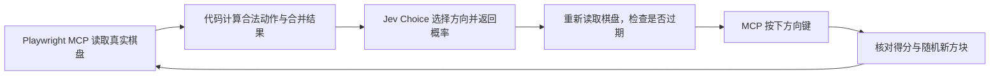

# 2048 · Jev 决策实验室

一个本地运行的自动玩游戏工具。Playwright MCP 操作真实的 https://2048.io/，Jev 为每一步选择方向，面板展示实际棋盘、候选走法、模型概率、调用耗时和执行记录。

所有项目源码、依赖与运行产物都位于此子项目中。API key 从当前进程的全局环境变量读取，不写入项目，也不传到网页或 MCP 子进程。

## 启动

需要 Node.js 22 或更新版本、npm，以及当前终端可以读取的 `TYPESAFE_API_KEY`。

在本目录打开终端，macOS 与 Windows 使用相同命令：

```sh
npm ci
npm start
```

在自己的 Chrome 中安装官方 [Playwright Extension](https://chromewebstore.google.com/detail/playwright-extension/mmlmfjhmonkocbjadbfplnigmagldckm)。打开 http://127.0.0.1:2048 ，点击「连接游戏」。工具通过扩展在日常 Chrome 中新开一个可见的 2048.io 游戏标签；后续重连和「显示游戏窗口」复用同一个标签。浏览器使用自己的站点存档，新标签可能恢复该 Chrome 中的进度；需要全新一局时点击「重新开始」。

运行调度由 Node 程序完成，无需 Codex、ChatGPT 或其他通用大模型。每一步仍调用 Jev 模型选择方向。扩展需要授权时按 Chrome 提示允许；已配置官方扩展令牌的环境可自动连接，令牌只通过环境传给 MCP 子进程，不写入项目。

扩展连接授权范围可能覆盖整个浏览器及已登录会话，具体以 Chrome 确认页为准；本工具的页面读取、置前和重开均检查 2048.io 来源。需要手动接管时先点击暂停。

- 「走一步」：调用一次 Jev，执行并验证一个动作。
- 「自动运行」：最多运行设定的步数，默认 2000 步，然后暂停。
- 「显示游戏窗口」：置前 MCP 实际控制的 Chrome 标签，不打开另一个网址。
- 「额外等待」：默认 0 ms，可输入 0–10000 ms；运行中修改即生效，点击「最快」清零。它不包括 Jev 请求和 MCP 操作本身的耗时。
- 「暂停」：取消进行中的模型请求；已发出的按键会完成校验，不再发出下一步。
- 「重新开始」：触发网站自己的 New Game 按钮，并开始新的记录文件。旧记录保留。
- 「输入与问题 / 模型返回 / 执行结果」：查看最近一步实际数据。
- 「导出完整 JSONL」：下载当前会话记录，包括已丢弃决策和失败请求的类型。

运行期间请不要手动移动游戏方块或切换工具所控制的 MCP 标签页。若推理期间棋盘发生变化，工具会丢弃决策并暂停。

## 迁移到 Windows

复制整个子项目即可；无需复制 `node_modules` 和 `artifacts`。在新设备安装同一个 Chrome 扩展，再按上面的两个命令安装依赖和运行。

在 Windows「编辑账户的环境变量」中配置用户变量 `TYPESAFE_API_KEY`，然后重新打开 PowerShell 或 VSCode 终端。macOS 中，配置在 `~/.zshrc` 的变量需要新开的交互式 zsh，或先在已有终端执行 `source ~/.zshrc`。已经启动的 GUI 应用和服务不会自动继承之后修改的变量。

程序不读取某台机器的 shell 配置文件，不包含 macOS 用户目录、AppleScript、POSIX 启动脚本或 Windows 专属启动脚本。启动 MCP 使用 `process.execPath` 和独立参数数组，路径通过 Node 的路径 API 解析。

当前验证环境为 macOS；Windows 尚未实机运行，迁移时仍应执行 `npm test` 并验证一次真实单步。

## Playwright MCP 连接方式

| 方式 | 配置与适用情况 | 特点 |
| --- | --- | --- |
| 本地 stdio + Chrome 扩展，默认 | 不配置 `PLAYWRIGHT_MCP_URL` | 工具启动锁定版本的官方 Playwright MCP，在自己的 Chrome 中新开可见游戏标签。 |
| 已有 HTTP MCP | 设置 `PLAYWRIGHT_MCP_URL` 为已有服务的 Streamable HTTP 地址 | 复用设备上已启动的服务；浏览器设置由该服务决定；服务应配置为连接自己的 Chrome，工具将新开游戏标签。 |

agent 中安装的 stdio MCP 通常由该 agent 管理，独立 Node 程序不能直接接管那个 stdio 连接。默认方式仍然通过标准 MCP 协议调用官方 Playwright MCP，游戏控制没有绕过 MCP 使用直接 Playwright 客户端。

如需一个可连接的 HTTP MCP 服务，可在本目录的另一个终端运行：

```sh
npx playwright-mcp --config mcp.config.json --port 8931 --output-dir artifacts/mcp-http
```

该服务会打印可连接的地址。此项目测试使用的地址是 `http://localhost:8931/mcp`。

在启动工具的终端中设置地址：

macOS / zsh：

```sh
export PLAYWRIGHT_MCP_URL=http://localhost:8931/mcp
npm start
```

Windows / PowerShell：

```powershell
$env:PLAYWRIGHT_MCP_URL = 'http://localhost:8931/mcp'
npm start
```

程序当前支持 stdio 和 Streamable HTTP，不支持旧版 SSE 地址或需要自定义鉴权头的 MCP 服务。HTTP MCP 必须提供 `browser_tabs`、`browser_evaluate`、`browser_press_key`，以及 `browser_run_code` 或 `browser_run_code_unsafe`（用于置前已有页面）。

## 工作流程与能力边界



- 网站规则由代码计算：移动方向、单回合合并、合法性和候选棋盘都可验证。
- 每一步实际方向由 Jev 选择。提供的候选指标包括合并分数、空格数、大方块是否在角落以及相邻同值对数；没有用启发式分数替代 Jev 选方向。
- `Choice` 返回方向、每个合法方向的概率与置信度。置信度反映分布的集中程度，不是达到 2048 的概率，也不是游戏正确率。
- Jev 不生成文字推理。本面板展示结构化输入、返回值和执行证据，不虚构模型的思考过程。
- 模型出错、超时或返回无效方向会暂停，不使用随机走法兜底。
- 读取棋盘采用当前标签页的可见方块，避免其他同源标签页覆盖共享存档而干扰决策。仅读取；从不修改存档、分数或直接调用游戏内部移动函数。
- 每次合法按键后，实际棋盘必须等于预计算结果加一个随机的 2 或 4，且得分必须匹配，否则停止。
- 达到 2048、游戏结束或达到本轮步数上限时自动停止。

这是 Jev 决策和 MCP 执行的可观测演示。当前没有实现搜索树或最优策略，也没有证明 Jev 能稳定达到 2048。

## 配置项

| 位置 | 字段 | 默认值与含义 |
| --- | --- | --- |
| 用户环境变量 | `TYPESAFE_API_KEY` | 必填，由 SDK 仅在服务端读取。 |
| 环境变量 | `TYPESAFE_DEFAULT_MODEL` | `jev-latest`；可指定账号可用的版本。实际返回版本显示在面板并写入记录。 |
| 环境变量，SDK 自带 | `TYPESAFE_BASE_URL` | `https://api.typesafe.ai`；自定义地址会改变请求目标，当前真实验证使用官方默认地址。 |
| 环境变量 | `PLAYWRIGHT_MCP_URL` | 未设置时使用本地 stdio；设置后连接指定的 Streamable HTTP MCP。 |
| 环境变量 | `PORT` | `2048`；本地面板端口，监听 `127.0.0.1`。 |
| `mcp.config.json` | `extension` | `true`，连接日常 Chrome/Edge，并通过 MCP 新开游戏标签。 |
| `mcp.config.json` | `timeouts.settle` | `0`，移除 MCP 固定的动作后等待；程序仍保留实际棋盘校验与短暂重读。 |
| 面板 | 运行步数 | 每次 1–2000 步，默认 2000 步。 |
| 面板 | 额外等待 | 0–10000 毫秒，默认 0，可在运行中修改；减少等待会立即唤醒正在等待的循环。模型和 MCP 本身耗时另计。 |

从新局开始的 100 步最多累计 408 的方块总数值，无法合成 2048。因此默认上限改为 2000；这只是运行保护上限，不能保证在上限内获胜，游戏结束或达到 2048 会提前停止。

完整浏览器选项见 `mcp.config.json`。更改启动配置或环境变量后重启服务。

## 文件与记录

```text
2048-jev/
├── src/
│   ├── browser.js   MCP 连接、棋盘读取和按键
│   ├── errors.js    对外诊断信息脱敏
│   ├── game.js      确定性游戏规则与执行校验
│   ├── jev.js       真实 Jev 请求及返回约束
│   ├── runner.js    单步、循环、暂停、过期检查与记录
│   └── server.js    本地面板服务与事件推送
├── public/         演示面板
├── test/           规则与流程控制测试
├── mcp.config.json
├── package.json
├── package-lock.json
└── artifacts/      自动生成的 JSONL、MCP 日志与截图
```

记录文件以会话 UUID 命名，包含棋盘、候选走法、问题、返回值、用量、耗时和校验结果。面板保留最近 100 条执行摘要，完整记录持续保存在本机。重新连接会沿用当前会话，重新开始会建立新会话。

## 验证与排查

```sh
npm test
```

测试覆盖合并、方向、移动守恒、合法走法、随机新方块、暂停、过期决策、并发操作和 API 失败。测试替身仅用于流程测试，不是演示模式，不会被生产代码用于自动玩游戏。

- 提示密钥未配置：从能读取全局变量的新终端运行 `npm start`，不要把 key 填进项目文件。
- 连接等待或失败：确认 Chrome 正在运行、官方扩展已安装，并按连接页提示允许；无需预先打开游戏页。HTTP 模式需确认服务连接的是你自己的浏览器。
- 连接中断：检查启动服务的终端是否退出；外部 HTTP MCP 还需确认其进程和地址可访问。
- 提示棋盘不匹配：停止手动操作，再重新连接；若重复出现，检查 `src/browser.js` 的网站解析规则。
- 端口占用：配置其他 `PORT` 后重新启动。

官方参考：[TypeSafe JavaScript SDK](https://docs.typesafe.ai/sdk/javascript.md)、[Choice](https://docs.typesafe.ai/primitives/choice.md)、[Playwright MCP](https://github.com/microsoft/playwright-mcp)。
